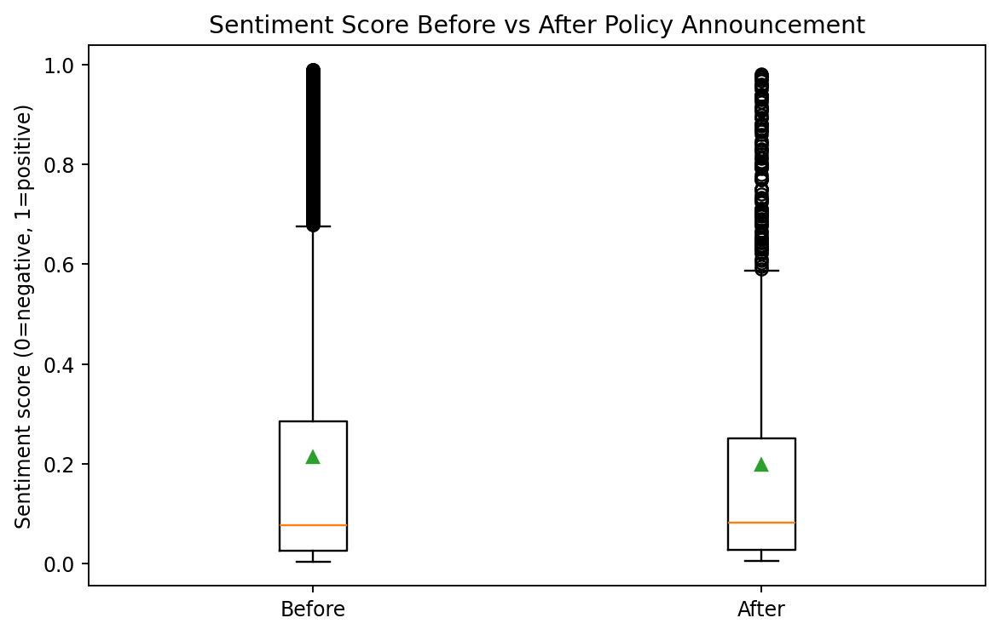

# Hypothesis Testing & Bias Assessment

## Hypothesis
- **H0:** No difference in sentiment scores before vs after policy announcement.
- **H1:** A significant difference exists.

## Main Test Results
- Announcement date used: **2026-01-14**
- Test selected after normality check: **Mann-Whitney U**
- Test statistic: **u_stat = 1876372.5000**
- p-value: **0.900737** (not significant)
- Cohen's d (after-before): **-0.056**
- 95% CI of mean difference (after-before): **[-0.0331, 0.0033]**
- Means: before=0.2129, after=0.1976

## Sensitivity Analysis (Exclude top 5% most active entities, proxy)
- Removed entities: **102**
- Removed rows: **1930** (39.7%)
- Sensitivity test: **Mann-Whitney U**
- Statistic: **u_stat = 823022.0000**
- p-value: **0.008813** (significant)
- Cohen's d: **-0.115**
- 95% CI mean diff: **[-0.0567, -0.0096]**

## Bias Considerations
- Geographic imbalance estimated using domain-TLD proxy (approximate).
- Platform algorithm bias acknowledged (ranking/recommendation effects).
- Time-window bias quantified via ±30-day concentration.
- High-activity over-representation addressed via top-5% entity exclusion sensitivity test.

## Semantic Driver Transparency
- Positive/negative drivers are from **smoothed log-odds** of token frequencies between positive vs negative corpora.
- A positive log-odds means a term is relatively over-represented in positive posts; negative log-odds means over-represented in negative posts.
- See: `outputs/semantic_drivers.csv`.

