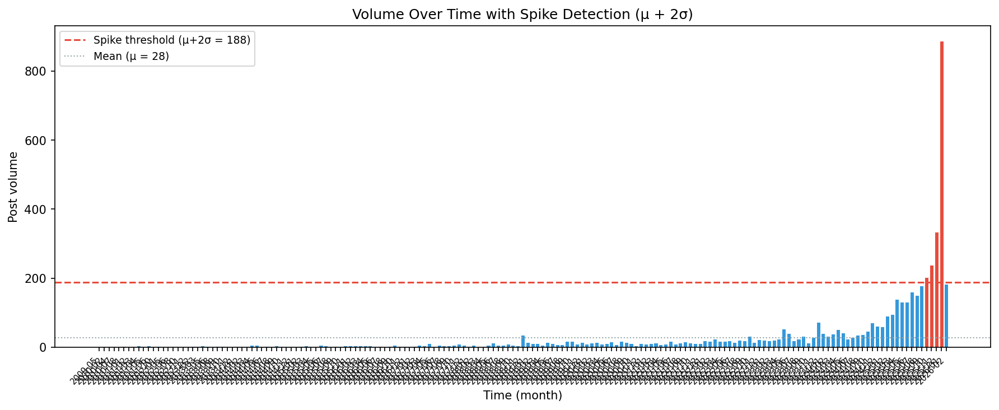

# Phase 3 Results — Whole Milk in Schools Sentiment Analysis

## A) Data Retention

| Stage | Count | Retention % |
|-------|------:|------------:|
| Raw extraction | 4,867 | 100.0% |
| Deduplication | 4,867 | 100.0% |
| Length filter (>=15 chars) | 4,867 | 100.0% |
| Final analytic dataset | 4,867 | 100.0% |

Data retention was 100.0%.

## B) Sentiment Distribution

### Overall

| Metric | Value |
|--------|------:|
| Total documents | 4,867 |
| Positive | 820 (16.8%) |
| Negative | 1,510 (31.0%) |
| Neutral | 2,537 (52.1%) |
| **Positive:Negative ratio** | **0.54:1** |

**Probability distribution:** P(positive) = 0.1685, P(negative) = 0.3103, P(neutral) = 0.5213

### By Source

| Source | Total | Pos % | Neg % | Neu % | Pos:Neg Ratio |
|--------|------:|------:|------:|------:|---------------|
| bluesky | 1,523 | 24.7% | 32.6% | 42.7% | 0.76:1 |
| news_rss | 607 | 6.8% | 6.9% | 86.3% | 0.98:1 |
| reddit | 2,737 | 14.7% | 35.5% | 49.8% | 0.42:1 |

## C) Spike Detection

- **Mean volume (μ):** 28.13 posts/bin
- **Standard deviation (σ):** 80.00
- **Spike threshold (μ + 2σ):** 188.13
- **Spike periods:** 2025-10, 2025-11, 2025-12, 2026-01

*Showing bins from 2024 onward (full table in `outputs/spike_table.csv`):*

| Time Bin | Volume | Z-Score | Spike? |
|----------|-------:|--------:|--------|
| 2024-01 | 40 | 0.15 |  |
| 2024-02 | 33 | 0.06 |  |
| 2024-03 | 38 | 0.12 |  |
| 2024-04 | 51 | 0.29 |  |
| 2024-05 | 42 | 0.17 |  |
| 2024-06 | 25 | -0.04 |  |
| 2024-07 | 29 | 0.01 |  |
| 2024-08 | 35 | 0.09 |  |
| 2024-09 | 37 | 0.11 |  |
| 2024-10 | 47 | 0.24 |  |
| 2024-11 | 71 | 0.54 |  |
| 2024-12 | 62 | 0.42 |  |
| 2025-01 | 60 | 0.40 |  |
| 2025-02 | 90 | 0.77 |  |
| 2025-03 | 96 | 0.85 |  |
| 2025-04 | 139 | 1.39 |  |
| 2025-05 | 131 | 1.29 |  |
| 2025-06 | 132 | 1.30 |  |
| 2025-07 | 161 | 1.66 |  |
| 2025-08 | 150 | 1.52 |  |
| 2025-09 | 179 | 1.89 |  |
| 2025-10 | 203 | 2.19 | **YES** |
| 2025-11 | 238 | 2.62 | **YES** |
| 2025-12 | 335 | 3.84 | **YES** |
| 2026-01 | 887 | 10.74 | **YES** |
| 2026-02 | 184 | 1.95 |  |

## D) Overall Summary

- **Data retention:** 100.0% — 4,867 documents in the final analytic dataset.
- **Positive:Negative ratio:** 0.54:1 — negative sentiment outweighs positive across all sources.
- **Probability distribution:** P(pos) = 0.1685, P(neg) = 0.3103, P(neu) = 0.5213 — the majority of discourse is neutral, with negative sentiment roughly double that of positive.
- **Peak period(s):** 2025-10, 2025-11, 2025-12, 2026-01 — these bins exceeded the μ+2σ threshold, indicating statistically elevated discussion volume.
