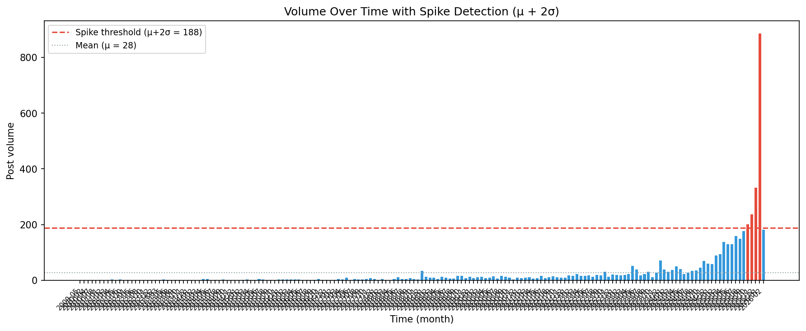
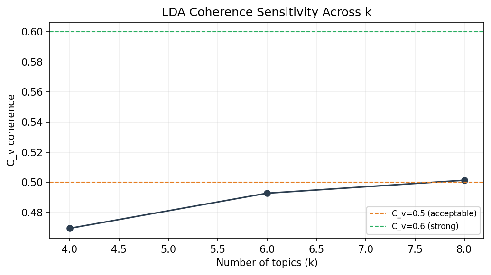

# Phase 3 Results — Whole Milk in Schools Sentiment Analysis

## A) Data Retention

| Stage | Count | Retention % |
|-------|------:|------------:|
| Raw extraction | 4,867 | 100.0% |
| Deduplication | 4,867 | 100.0% |
| Length filter (>=15 chars) | 4,867 | 100.0% |
| Final analytic dataset | 4,867 | 100.0% |

Data retention was 100.0%.

## B) Sentiment Distribution

### Overall

| Metric | Value |
|--------|------:|
| Total documents | 4,867 |
| Positive | 820 (16.8%) |
| Negative | 1,510 (31.0%) |
| Neutral | 2,537 (52.1%) |
| **Positive:Negative ratio** | **0.54:1** |

**Probability distribution:** P(positive) = 0.1685, P(negative) = 0.3103, P(neutral) = 0.5213

### By Source

| Source | Total | Pos % | Neg % | Neu % | Pos:Neg Ratio |
|--------|------:|------:|------:|------:|---------------|
| bluesky | 1,523 | 24.7% | 32.6% | 42.7% | 0.76:1 |
| news_rss | 607 | 6.8% | 6.9% | 86.3% | 0.98:1 |
| reddit | 2,737 | 14.7% | 35.5% | 49.8% | 0.42:1 |

## C) Spike Detection

- **Mean volume (μ):** 28.13 posts/bin
- **Standard deviation (σ):** 80.00
- **Spike threshold (μ + 2σ):** 188.13
- **Spike periods:** 2025-10, 2025-11, 2025-12, 2026-01

*Showing bins from 2024 onward (full table in `outputs/spike_table.csv`):*

| Time Bin | Volume | Z-Score | Spike? |
|----------|-------:|--------:|--------|
| 2024-01 | 40 | 0.15 |  |
| 2024-02 | 33 | 0.06 |  |
| 2024-03 | 38 | 0.12 |  |
| 2024-04 | 51 | 0.29 |  |
| 2024-05 | 42 | 0.17 |  |
| 2024-06 | 25 | -0.04 |  |
| 2024-07 | 29 | 0.01 |  |
| 2024-08 | 35 | 0.09 |  |
| 2024-09 | 37 | 0.11 |  |
| 2024-10 | 47 | 0.24 |  |
| 2024-11 | 71 | 0.54 |  |
| 2024-12 | 62 | 0.42 |  |
| 2025-01 | 60 | 0.40 |  |
| 2025-02 | 90 | 0.77 |  |
| 2025-03 | 96 | 0.85 |  |
| 2025-04 | 139 | 1.39 |  |
| 2025-05 | 131 | 1.29 |  |
| 2025-06 | 132 | 1.30 |  |
| 2025-07 | 161 | 1.66 |  |
| 2025-08 | 150 | 1.52 |  |
| 2025-09 | 179 | 1.89 |  |
| 2025-10 | 203 | 2.19 | **YES** |
| 2025-11 | 238 | 2.62 | **YES** |
| 2025-12 | 335 | 3.84 | **YES** |
| 2026-01 | 887 | 10.74 | **YES** |
| 2026-02 | 184 | 1.95 |  |

## D) Overall Summary

- **Data retention:** 100.0% — 4,867 documents in the final analytic dataset.
- **Positive:Negative ratio:** 0.54:1 — negative sentiment outweighs positive across all sources.
- **Probability distribution:** P(pos) = 0.1685, P(neg) = 0.3103, P(neu) = 0.5213 — the majority of discourse is neutral, with negative sentiment roughly double that of positive.
- **Peak period(s):** 2025-10, 2025-11, 2025-12, 2026-01 — these bins exceeded the μ+2σ threshold, indicating statistically elevated discussion volume.

## 3.3 Topic Modeling & Semantic Drivers
### 3.3.1 Coherence Reporting
- **Method:** LDA (scikit-learn) with Gensim C_v coherence evaluation
- **Best k:** 8
- **Best C_v coherence:** 0.5013 (acceptable)
- **LDA priors:** alpha=0.1, beta(eta)=0.01
- **Training setup:** iterations=50, random_seed=42

| k | C_v |
|---:|---:|
| 4 | 0.4694 |
| 6 | 0.4927 |
| 8 | 0.5013 |

### 3.3.2 Model Comparison
| Model | Topics | C_v | Interpretation Quality | Notes |
|-------|-------:|----:|------------------------|-------|
| LDA | 8 | 0.5013 | Moderate | Broad-to-moderate thematic groupings |
| NMF (TF-IDF) | 8 | 0.5358 | Strong | Alternative baseline; often sharper lexical boundaries |

Model choice is justified by coherence and interpretation quality with fixed, reproducible seeds.

### 3.3.3 Stability Testing
- **Seed stability (topic overlap consistency):** mean=0.700, sd=0.424 across 2 runs
- **Bootstrap stability (80% resamples):** mean=0.392, sd=0.065 across 2 runs
- **Consistency metric:** symmetric average of max Jaccard overlap between topic word sets (top-10 words/topic).

Stability outputs: `outputs/topic_stability_seed.csv`, `outputs/topic_stability_bootstrap.csv`.

### 3.3.4 Semantic Drivers of Sentiment
Ranked using smoothed log-odds (positive vs negative corpora, informative prior).

| Rank | Negative Drivers | Positive Drivers |
|-----:|------------------|------------------|
| 1 | policy (-1.239) | healthy (0.820) |
| 2 | usda (-0.942) | nutrition (0.646) |
| 3 | parents (-0.938) | chocolate (0.540) |
| 4 | children (-0.802) | dairy (0.418) |
| 5 | food (-0.402) | whole (0.190) |
| 6 | fat (-0.358) | cafeteria (0.115) |
| 7 | student (-0.243) | schools (0.084) |
| 8 | kids (-0.097) | students (0.076) |
| 9 | health (-0.026) | lunch (0.075) |
| 10 | school (-0.006) | milk (0.064) |

These terms act as explanatory mechanisms by quantifying which words are disproportionately associated with negative versus positive sentiment.
