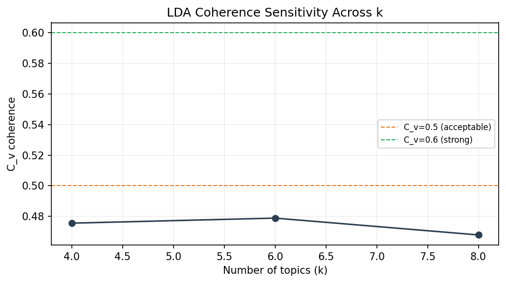

## 3.3 Topic Modeling & Semantic Drivers
### 3.3.1 Coherence Reporting
- **Method:** LDA (scikit-learn) with Gensim C_v coherence evaluation
- **Best k:** 6
- **Best C_v coherence:** 0.4789 (below-acceptable (requires justification))
- **LDA priors:** alpha=0.1, beta(eta)=0.01
- **Training setup:** iterations=50, random_seed=42

| k | C_v |
|---:|---:|
| 4 | 0.4756 |
| 6 | 0.4789 |
| 8 | 0.4679 |

### 3.3.2 Model Comparison
| Model | Topics | C_v | Interpretation Quality | Notes |
|-------|-------:|----:|------------------------|-------|
| LDA | 6 | 0.4789 | Weak | Broad-to-moderate thematic groupings |
| NMF (TF-IDF) | 6 | 0.5286 | Moderate | Alternative baseline; often sharper lexical boundaries |

Model choice is justified by coherence and interpretation quality with fixed, reproducible seeds.

### 3.3.3 Stability Testing
- **Seed stability (topic overlap consistency):** mean=0.752, sd=0.351 across 2 runs
- **Bootstrap stability (80% resamples):** mean=0.403, sd=0.050 across 2 runs
- **Consistency metric:** symmetric average of max Jaccard overlap between topic word sets (top-10 words/topic).

Stability outputs: `outputs/topic_stability_seed.csv`, `outputs/topic_stability_bootstrap.csv`.

### 3.3.4 Semantic Drivers of Sentiment
Ranked using smoothed log-odds (positive vs negative corpora, informative prior).

| Rank | Negative Drivers | Positive Drivers |
|-----:|------------------|------------------|
| 1 | children (-0.867) | law (1.856) |
| 2 | dairy (-0.680) | congress (1.569) |
| 3 | kids (-0.662) | federal (0.941) |
| 4 | cafeteria (-0.624) | students (0.846) |
| 5 | food (-0.465) | health (0.839) |
| 6 | whole (-0.311) | bill (0.829) |
| 7 | nutrition (-0.174) | lunch (0.780) |
| 8 | fat (-0.138) | chocolate (0.772) |
| 9 | milk (-0.089) | trump (0.713) |
| 10 | school (-0.080) | act (0.472) |

These terms act as explanatory mechanisms by quantifying which words are disproportionately associated with negative versus positive sentiment.
